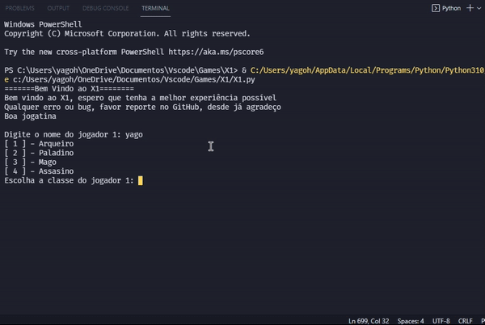

# X1 ⚔️

_É recomendo o uso de algum interpretador, e não do terminal, para uma melhor experiência_

Um jogo criado em Python para ser jogado por 2 pessoas, estilo RPG;

O jogo possui 4 classes: Arqueiro, Paladino, Mago e Assasino

# **Arquerio** 🏹
Com suas diversas habilades envolvendo arco e flecha é capaz de ferir seu adversário, podendo até envenena-ló com sua _Flecha Envenenada_, ou até mesmo atrapalhar a pontaria do adversário com sua _Bomba de Fumaça_

# **Paladino** 🛡️
Um indivíduo com grandes habilidades com sua Espada e Escudo podendo melhorar sua defesa com sua habilidade _Escudo Divino_, ou até mesmo aumentar sua força usando de seus sentimentos para invocar a _Ira_

# **Mago** ⚚
Um indivíduo esperto com diversas magias que impõe muitas restições ao adversário, e caso saiba ultiliza-lás será um terrivél inimigo para se enfrentar. É capaz de realizar diversos combos ultilizando suas magias em certas ordens como o _Ataque ELEMENTAL_

# **Assasino** 🗡️
Um especialista na arte de matar, capaz de realizar _Ataques Furtivos_, de inflingir veneno aos inimigos com sua _Adaga Envenenada_, ou até mesmo lanca-lá e quando estiver desprevenido, preocupando-se com o veneno fique esperto com a _Apunhalada_

#
Esse jogo teve como intuito o aprendizado de Python, tentando, apenas por linhas de cógidos, trazer uma diversão para quem jogar;

Espero que gostem
